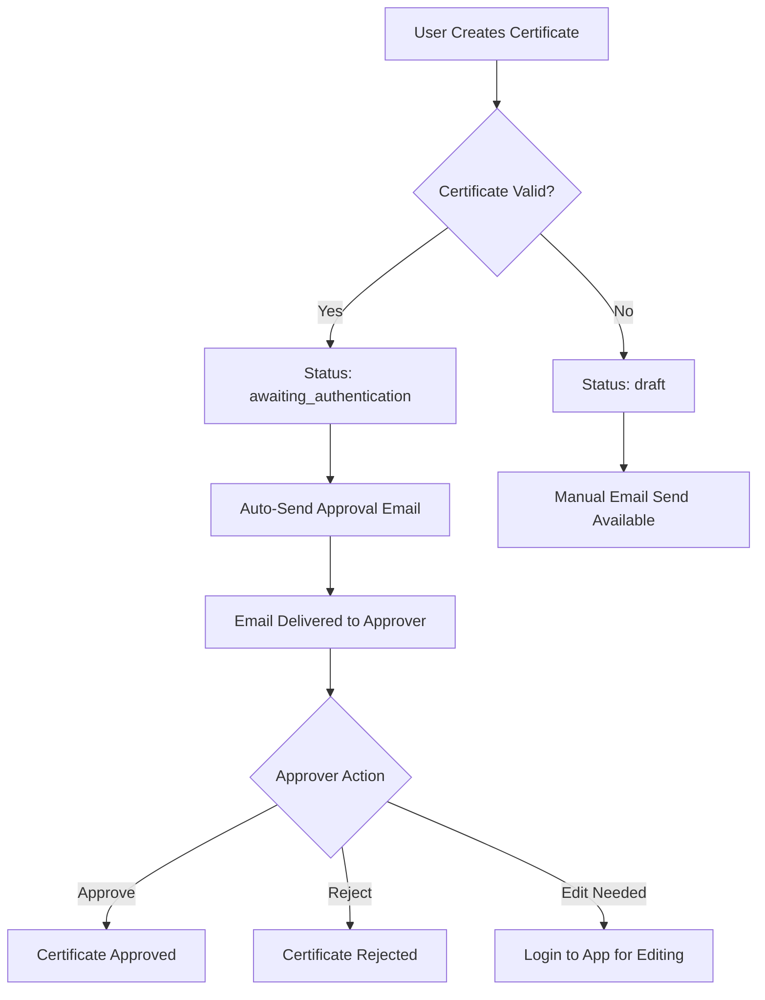

# 📧 Email-Based Certificate Approval System

This document explains how to set up and use the email-based certificate approval feature in the Calibre Certificate Management System.

## 🎯 **Overview**

The email approval system allows certificates to be approved or rejected directly from email notifications, streamlining the approval workflow for remote approvers.

### **Key Features:**
- ✅ **Email Notifications**: Automatic emails sent when certificates are created
- 🖼️ **Certificate Preview**: Full certificate preview embedded in email
- ⚡ **One-Click Actions**: Approve or reject directly from email
- 🔒 **Secure Tokens**: Token-based approval links for security
- 📊 **Tracking**: Email status tracking in admin dashboard
- 🌐 **Localhost Support**: Works on development environments

---

## 🚀 **Setup Instructions**

### **1. Configure Email Settings**

1. **Navigate to Settings**: Go to `/settings` in your application
2. **Email Configuration Section**: Scroll to "Email Configuration"
3. **Configure SMTP Settings**:
   ```
   SMTP Host: smtp.gmail.com (for Gmail)
   SMTP Port: 587
   SMTP Username: your-email@gmail.com
   SMTP Password: your-app-specific-password
   ```

   > **For Gmail Users**: Use an [App-Specific Password](https://support.google.com/accounts/answer/185833) instead of your regular password.

4. **Enable Email Approvals**: Toggle "Enable Email-Based Certificate Approvals"
5. **Set Approval Email**: Enter the email address that should receive approval notifications
6. **Test Configuration**: Click "Test Email Configuration" to verify setup
7. **Save Settings**: Click "Save Settings" to apply changes

### **2. Gmail Setup (Recommended for localhost)**

For development/localhost testing with Gmail:

1. **Enable 2-Factor Authentication** on your Google account
2. **Generate App Password**:
   - Go to Google Account Settings → Security
   - Select "2-Step Verification" → "App passwords"
   - Generate a password for "Mail"
   - Use this password in SMTP settings

3. **Configuration Example**:
   ```
   SMTP Host: smtp.gmail.com
   SMTP Port: 587
   SMTP Username: youremail@gmail.com
   SMTP Password: your-16-character-app-password
   ```

---

## 📋 **How It Works**

### **Certificate Creation Flow**



### **Email Content**

Each approval email includes:
- 📄 **Certificate Details**: Number, product, batch, customer info
- 🖼️ **Preview Link**: Full certificate preview
- ✅ **Approve Button**: One-click approval
- ❌ **Reject Button**: One-click rejection
- 🔗 **App Link**: Link to login for manual editing

### **Security Features**

- 🔐 **Token-Based URLs**: Each email contains unique approval tokens
- ⏰ **Token Validation**: Tokens tied to certificate creation timestamp
- 🚫 **Single Use**: Prevents duplicate actions on same certificate
- 🔒 **Status Checking**: Validates certificate is still pending approval

---

## 🛠️ **Using the System**

### **For Certificate Creators**

1. **Create Certificate**: Generate certificate as usual
2. **Automatic Email**: If certificate passes validation, approval email is sent automatically
3. **Manual Send**: For draft certificates, use "Send Approval Email" button in Certificate Approvals page

### **For Approvers**

1. **Receive Email**: Get approval notification in configured email
2. **Review Certificate**: Click "View Certificate Preview" to see full certificate
3. **Take Action**:
   - **✅ Approve**: Click "APPROVE" button for immediate approval
   - **❌ Reject**: Click "REJECT" button to reject certificate
   - **📝 Edit**: Click "Login to Application" for manual editing

### **For Administrators**

1. **Monitor Status**: View email status in Certificate Approvals page
2. **Resend Emails**: Use "Resend" button for certificates with sent emails
3. **Manual Override**: Always available to approve/reject manually in app

---

## 📊 **Admin Dashboard Features**

### **Certificate Approvals Page**

- 📧 **Email Status Indicator**: Shows if approval email was sent
- 🕐 **Send Timestamp**: When email was sent
- 🔄 **Resend Button**: Resend approval emails if needed
- 📍 **Status Tracking**: Visual indicators for email sent status

### **Settings Page**

- ⚙️ **SMTP Configuration**: Complete email server setup
- 🧪 **Test Email**: Verify configuration before going live
- 🔘 **Enable/Disable**: Toggle email approvals on/off
- 📮 **Approval Email**: Configure who receives approval notifications

---

## 🔧 **API Endpoints**

The system includes several API endpoints:

### **Email Sending**
```
POST /api/send-approval-email
Body: { certificateId: string }
```

### **Email Actions**
```
GET /api/certificate-approval/approve?token=xxx&certificateId=xxx
GET /api/certificate-approval/reject?token=xxx&certificateId=xxx
```

### **Certificate Preview**
```
GET /api/certificate-preview/[certificateId]?token=xxx
```

### **Email Testing**
```
POST /api/test-email
Body: { smtpSettings: EmailSettings }
```

---

## 🐛 **Troubleshooting**

### **Common Issues**

#### **Email Not Sending**
- ✅ Verify SMTP settings are correct
- ✅ Check app-specific password for Gmail
- ✅ Ensure "Enable Email Approvals" is turned on
- ✅ Verify approval email is configured
- ✅ Test email configuration

#### **Approval Links Not Working**
- ✅ Check if certificate is still in "awaiting_authentication" status
- ✅ Verify token hasn't expired
- ✅ Ensure certificate hasn't already been processed

#### **Gmail Issues**
- ✅ Enable 2-Factor Authentication
- ✅ Use App-Specific Password (not regular password)
- ✅ Check "Less secure app access" is disabled (use app passwords instead)

#### **Localhost Testing**
- ✅ Use full domain in APP_URL environment variable
- ✅ Gmail SMTP works well for localhost development
- ✅ Consider using services like MailHog for testing

### **Error Messages**

| Error | Solution |
|-------|----------|
| "Email settings not configured" | Complete SMTP configuration in settings |
| "No approval email configured" | Set approval email address in settings |
| "Email approvals disabled" | Enable email approvals toggle |
| "Invalid or expired token" | Use fresh link from latest email |
| "Certificate already processed" | Certificate was already approved/rejected |

---

## 🌟 **Best Practices**

### **For Setup**
- 🔐 Use app-specific passwords for Gmail
- 📧 Test email configuration before enabling
- 🏢 Use a dedicated approval email address
- 📝 Document SMTP credentials securely

### **For Usage**
- 📱 Check approval emails regularly
- 🖼️ Always review certificate preview before action
- 🔄 Use resend feature if emails are missed
- 💻 Use manual approval for complex cases

### **For Security**
- 🔒 Keep SMTP credentials secure
- ⏰ Act on approval emails promptly
- 🚫 Don't share approval email links
- 🔐 Use strong passwords for email accounts

---

## 📈 **Future Enhancements**

Potential improvements for the system:
- 📱 Mobile-optimized email templates
- 📊 Advanced analytics on approval times
- 🔔 Slack/Teams integration
- 📝 Approval comments in emails
- 🔄 Bulk approval capabilities
- 📅 Scheduled reminders for pending approvals

---

## 💡 **Tips for Success**

1. **Start Small**: Begin with one approval email for testing
2. **Test Thoroughly**: Use test email functionality before production
3. **Monitor Regularly**: Check email status in admin dashboard
4. **Have Backups**: Always maintain manual approval capability
5. **Document Process**: Train approvers on email workflow
6. **Security First**: Use secure email practices and strong passwords

---

## 📞 **Support**

For technical support or questions about the email approval system:
- 📖 Check this documentation first
- 🐛 Review troubleshooting section
- 💻 Test configuration using built-in tools
- 📧 Verify email server connectivity

The email approval system is designed to streamline certificate workflows while maintaining security and reliability. With proper setup, it provides a seamless approval experience for remote teams.
